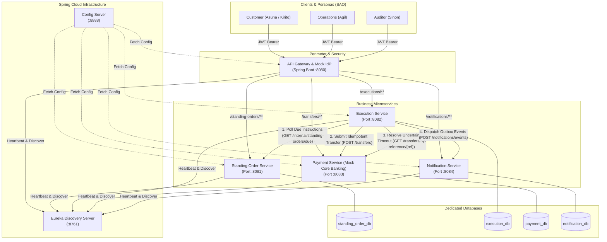

# EastWest Bank (EWB) Standing Order Platform: Architecture & Service Boundaries

## 1. System Overview

The **EWB Standing Order Platform** is an enterprise-grade, distributed microservices solution built with **Java 21 LTS**, **Spring Boot 3.3.4**, and **Spring Cloud (Eureka & Config Server)**. It automates recurring standing orders, enforces strict idempotency against Core Banking systems, prevents duplicate debits, and provides asynchronous, decoupled notification delivery with deduplication.

---

## 2. Service Decomposition & Port Allocations

| Service Name | Port | Database | Primary Responsibility | Owned By |
| :--- | :--- | :--- | :--- | :--- |
| **`config-server`** | `8888` | Local Git / Native | Centralized configuration repository for all environments | Member 4 |
| **`eureka-server`** | `8761` | In-Memory Registry | Netflix Eureka service discovery & heartbeat monitoring | Member 4 |
| **`gateway-service`** | `8080` | Stateless (Mock IdP) | Reverse proxy, Mock IdP (`/auth/login`), JWT validation, downstream header injection, RBAC | Member 4 |
| **`standing-order-service`** | `8081` | `standing_order_db` (H2) | Standing order lifecycle (create, pause, resume, cancel), versioning, schedule calendar | Member 1 |
| **`execution-service`** | `8082` | `execution_db` (H2) | Due instruction discovery, worker lease claiming, cut-off checks, transactional outbox | Member 3 |
| **`payment-service`** | `8083` | `payment_db` (H2) | Mock Core Banking: double-entry ledger, balance checks, frozen account check, idempotency | Member 2 |
| **`notification-service`** | `8084` | `notification_db` (H2) | Asynchronous outbox event consumer, event deduplication, delivery tracking | Member 4 |

---

## 3. High-Level Architecture Diagram

---

## 4. Service Boundaries Justification

1. **Isolation of Core Banking (`payment-service`)**:
   - The ledger and account balances are completely decoupled from scheduling logic.
   - Core banking operates with atomic double-entry bookkeeping (`DEBIT` and `CREDIT`) protected by unique idempotency keys (`{standingOrderId}:{scheduledOccurrenceUtc}`).
2. **Decoupled Asynchronous Execution (`execution-service`)**:
   - The scheduler claims due instructions with a 60-second lease to prevent parallel double-execution.
   - Outbox pattern ensures that external dispatch to notifications never rolls back or blocks completed payments.
3. **Dedicated Notification Consumer (`notification-service`)**:
   - Notification delivery is strictly decoupled and idempotent: duplicate event IDs received from network retries or message broker replays are detected via the `processed_events` unique index and skipped (`200 OK SKIPPED`).
   - Downstream notification gateway outages (`X-Simulate-Outage: true`) return `500` without impacting completed ledger transactions.
4. **Perimeter Security (`gateway-service`)**:
   - Centralizes authentication and token signing for all SAO personas.
   - Protects internal inter-service endpoints: external requests targeting `/internal/**` are rejected with `403 Forbidden`.
   - Enforces RBAC and customer account ownership before any request reaches internal domain microservices.

---

## 5. Security & RBAC Specifications

### Personas (contracts.md Section 2)

| Username | Name | Role | Primary Account |
| :--- | :--- | :--- | :--- |
| `asuna` | Asuna Yuuki | `ROLE_CUSTOMER` | `EWB-ASU-1001` (₱20,000.00), `EWB-ASU-2001` |
| `kirito` | Kazuto Kirigaya | `ROLE_CUSTOMER` | `EWB-KIR-5001` (₱50,000.00) |
| `klein` | Ryoutarou Tsuboi | `ROLE_CUSTOMER` | `EWB-KLN-4001` (₱2,000.00 - Low Balance) |
| `heathcliff` | Akihiko Kayaba | `ROLE_CUSTOMER` | `EWB-HTH-3001` (₱10,000.00 - FROZEN) |
| `agil` | Andrew Gilbert Mills | `ROLE_OPERATIONS` | N/A |
| `sinon` | Shino Asada | `ROLE_AUDITOR` | N/A |

### Downstream Forwarded Headers
The Gateway validates the JWT token and forwards verified identity claims down to all internal microservices:
- `X-User-Id`: Authenticated username (e.g. `asuna`)
- `X-User-Role`: Assigned role (e.g. `ROLE_CUSTOMER`)
- `X-User-Accounts`: Comma-separated list of customer owned accounts (e.g. `EWB-ASU-1001,EWB-ASU-2001`)

---

## 6. Zero-Blocker Local Development Guarantee

1. **Direct Port Access**: Services can be tested directly on their dedicated ports (`8081`, `8082`, `8083`, `8084`) by passing `X-User-Id` and `X-User-Role` headers.
2. **Contract Compliance**: All 4 members develop against the exact DTOs and JSON structures established in `contracts.md`.
